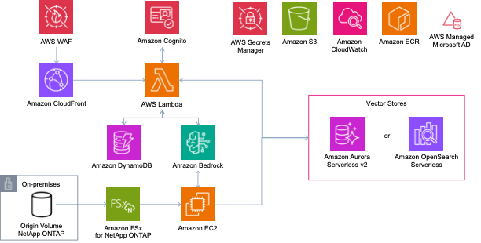
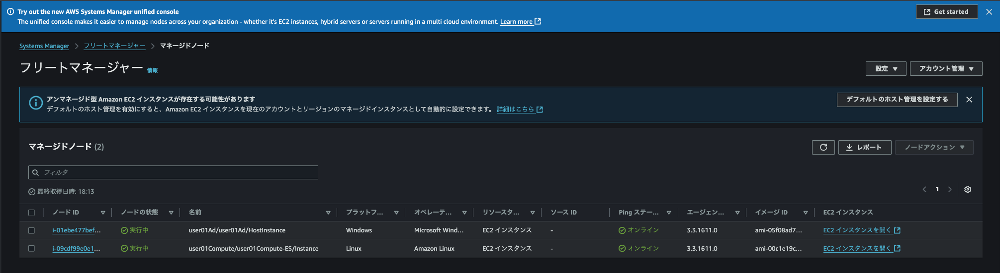
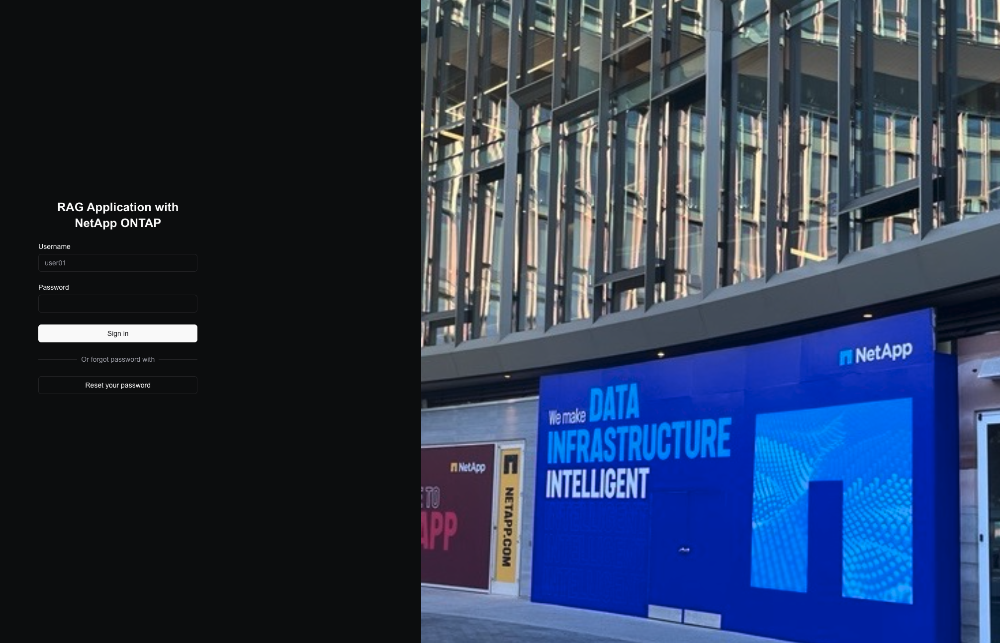
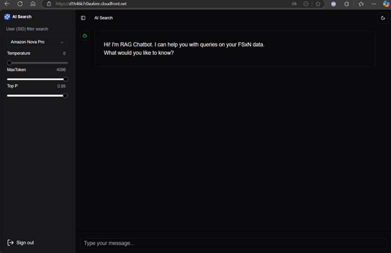

# RAG Chatbot with FSx for ONTAP

本プロトタイプは[Amazon FSx for NetApp ONTAP](https://aws.amazon.com/fsx/netapp-ontap/?nc1=h_ls)と[Amazon Bedrock](https://aws.amazon.com/bedrock/?nc1=h_ls)を利用した RAG Chatbot アプリケーションです。Chatbot アプリケーションは、[Nextjs](https://nextjs.org/) で実装した RAG Chatbot on AWS Lambda です。アプリケーションは [AWS WAF](https://aws.amazon.com/waf/?nc1=h_ls) でIPやGeo情報によって保護されており、API は IAM 認証を利用しています。RAG 検索で利用するベクトルデータベースは、[Amazon Aurora Serverless v2](https://docs.aws.amazon.com/AmazonRDS/latest/AuroraUserGuide/aurora-serverless-v2.html)、または[Amazon OpenSearch Serverless](https://aws.amazon.com/opensearch-service/features/serverless/?nc1=h_ls)(以下、AOSS)から選択できるようにしています。
Amazon FSx for NetApp ONTAP をマウントしている Embedding Server が選択したベクトルデータベースに対して、定期的にベクトルデータの追加/更新/削除を行います。データのベクトル化には[Amazon Titan Text Embeddings models](https://docs.aws.amazon.com/bedrock/latest/userguide/titan-embedding-models.html)を利用しています。

1. RAG Chatbot on AWS Lambda
   - [AWS Lambda Web Adapter](https://github.com/awslabs/aws-lambda-web-adapter) を利用して Nextjs を稼働

## アーキテクチャ



### 特徴

#### 1. セキュリティ
1. **AWS WAF**: アプリケーションへのアクセスを制御するファイアウォール。Web アプリケーションにアクセスできる CIDR を設定し、不正アクセスをブロックできます。保護対象として[Amazon CloudFront](https://aws.amazon.com/cloudfront/?nc2=type_a) を設定しています。
2. **[Amazon Cognito](https://aws.amazon.com/cognito/?nc1=h_ls)**: RAG Chatbot on AWS Lambda に関して、Amazon Cognito を利用してユーザー認証を行い、認証したユーザーのみ RAG 検索可能です。
3. **[AWS IAM](https://aws.amazon.com/iam/?nc2=type_a)**: [AWS Lambda](https://aws.amazon.com/lambda/?nc2=type_a) の Endpoint URL と[Amazon API Gateway](https://aws.amazon.com/api-gateway/)の Endpoint へのアクセス認証を行います。
4. **アクセスログ**: Chatbot アプリのアクセスログを有効化しており、[Amazon S3](https://aws.amazon.com/pm/serv-s3/?nc1=h_ls) や [Amazon CloudWatch Logs](https://docs.aws.amazon.com/AmazonCloudWatch/latest/logs/WhatIsCloudWatchLogs.html) に格納しています。

## License

このプロジェクトのライセンスは Amazon Software License([ASL](https://d1.awsstatic.com/legal/Amazon%20Software%20License/Amazon_Software_License__Japanese__04-18-2008.pdf)) に基づきます。

## RAG チャットアプリケーション設定

- `config.ts`ファイルの作成 : 以下のコマンドで config.ts ファイルを作成してください。

```zsh
cp config.sample.ts config.ts
```

各プロパティの定義は[type.ts](types/type.ts)に記載しています。

| プロパティ      | 説明                                                                                                                                                                                                                                                                                                                                                                 |
| --------------- | -------------------------------------------------------------------------------------------------------------------------------------------------------------------------------------------------------------------------------------------------------------------------------------------------------------------------------------------------------------------- |
| userName          | Amazon Cognito UserPool に登録するユーザー名。 後述する`userAccessTable`を利用する場合は、一意(Unique)にする必要があります。（CloudFormationのStack名の接頭語にも利用されます）|
|userEmail|Amazon Cognito UserPool に登録するユーザーのメールアドレス。|
| allowedIps      | AWS WAF 設定により Web アプリケーションに アクセス可能な CIDR を指定します。|
|networkConfig|新たにVPCを構築する場合や、既存のVPCを利用する場合の情報を記載|
| existingVpc     | 既存の VPC を利用する際は`true`、新規に VPC を作成する際は`false`を指定してください。ただし、既存の VPC を利用する場合は、`Private Subnet`(`SubnetType.PRIVATE_WITH_EGRESS`)、`Isolated Subnet`(`SubnetType.PRIVATE_ISOLATED`) と `VPC Endpoint`(`InterfaceVpcEndpointAwsService.RDS_DATA`と`InterfaceVpcEndpointAwsService.SECRETS_MANAGER`) があることが必須です。 |
| vpcId           | `existingVpc`が`true`の場合は、利用する VPC の VPC ID をここで必ず定義してください。|
|cidr|VPCが利用するネットワークのCIDR|
|subnetCidrMask|VPCサブネットのCIDRマスク|
|publicSubnet|新規VPC作成時にPublicSubnetを作成するかどうか|
|natSubnet|新規VPC作成時にNatSubnetを作成するかどうか|
|isolatedSubnet|新規VPC作成時にIsolatedSubnetを作成するかどうか|
|maxAzs|リージョンで利用する最大AZ数|
|fsxConfig|新規で作成されるFSx for NetApp ONTAPの設定|
|subnetIds|FSx for NetApp ONTAPをデプロイする指定のSubnetが別にある場合はこちらで指定。（空の場合はnetworkConfigで指定されたNetworkのPrivate Subnet上に構築）|
|storageCapacity|FSx for NetApp ONTAPの容量|
|deploymentType|FSx for NetApp ONTAPのデプロイタイプ（SINGLE_AZ_1 or MULTI_AZ_1）|
|throughputCapacity|FSx for NetApp ONTAPのスループット量|
|fsxAdminPassword|FSx for NetApp ONTAPの管理者パスワード（空の場合は自動で作成）|
|adConfig|FSx for NetApp ONTAPが参加するActive Directoryの設定|
|existingAD|既存のActive Directoryを利用する際は`true`、新規にActiveDirectoryを作成する際は`false`を指定。|
|svmNetBiosName|ActiveDirectory参加時に利用するFSx for NetApp ONTAPのNetBios名|
|adDnsIps|既存のActive Directoryを利用する場合に利用する、ADのIPアドレス|
|adDomainName|ActiveDirectoryのドメイン名|
|adAdminPassword|ActiveDirectoryの管理者パスワード（空の場合は自動で作成）|
|serviceAccountUserName|ActiveDirectoryの操作に使うサービスアカウントのユーザー名|
|serviceAccountPassword|ActiveDirectoryの操作に使うサービスアカウントのパスワード（空の場合はadAdminPasswordの値を利用）|
|adOu|ActiveDirectory参加時に利用するOrganizationUnit名|
|fileSystemAdministratorsGroup|委任されたファイルシステム管理者グループ名|
| userAccessTable | ログインユーザーの権限テーブルを利用する場合は、DynamoDB のテーブル名をここで定義してください。テーブルに関しての詳細は[権限テーブル](#権限テーブル)を確認してください。|
|chatAppConfig|Nextjsで実装されたチャットアプリケーションの設定|
|imagePath|アプリケーションのDockerイメージが格納されたディレクトリー|
|tag|ECRに登録時に利用するtag情報|
|lambdaVpcId|Lambdaが利用するVPCのID情報（空の場合はadConfigと同じVPC IDを利用）|
|lambdaVpcSubnets|Lambdaが利用するVPCのサブネット情報（subnetIdとvailabilityZoneの両方を指定する必要あり）|
|vectorConfig|VectorDBの設定|
| vector          | ベクトルデータベースに利用する AWS サービスを指定します。Amazon Aurora Serverless v2 を利用する場合は`aurora`、Amazon OpenSearch Serverless を利用する場合は`aoss`を指定してください。|
|collectionName|VectorDBのコレクション名|

## Deployment

### 前提条件

- Node.js

  - デプロイ実行するローカルマシンに Node.js バージョン、v18.20.2 以上のインストールが必要です。[こちら](https://nodejs.org/en/download/package-manager)のパッケージマネージャーを利用してインストール可能です。

- Docker Desktop

  - AWS Lambda のコードなどのファイルのビルドに利用します。[こちら](https://www.docker.com/products/docker-desktop/)のページからダウンロード可能です。
  - Multi-platform images ビルドの設定が必要です。今回コンテナ実行環境を ARM64 に指定しているため、デプロイ環境に応じて`docker run --privileged --rm tonistiigi/binfmt --install all`などの実行が必要です。
    - <https://docs.docker.com/build/building/multi-platform/#build-multi-platform-images>

- AWS CLI

  - [こちらの手順](https://docs.aws.amazon.com/ja_jp/cli/latest/userguide/getting-started-install.html)で AWS CLI をインストールしてください。

- jq

  - <https://jqlang.github.io/jq/>

- 設定ファイルと認証情報ファイルの設定

  - 以下のコマンドを利用して、任意の Profile 名で設定してください。設定詳細は[こちら](https://docs.aws.amazon.com/ja_jp/cli/latest/userguide/cli-configure-files.html)を参照ください。

  ```zsh
  aws configure --profile <任意のAWS PROFILE NAME>
  ```

### 1. 依存関係のインストール

以下のコマンドを実行してください。

```zsh
npm ci
```

### 2. デプロイ

RAGチャットアプリケーションは複数のCDKスタックを組み合わせてデプロイされます。

- Us：WAF、LambdaEdge
- Ad：Active Directory関連
- FSx：FSx for NetApp ONTAP関連
- Compute：アプリケーション関連

デプロイを実行する場合は、以下のコマンドを実行してください。(`YOUR_AWS_PROFILE`は先程設定した、AWS PROFILE NAME を利用してください。)

```zsh
# 一括の場合
npm run cdk deploy -- --all --profile test

# 分割の場合
npm run cdk ls  -- --profile test
npm run cdk deploy -- user01Us user01Ad --profile test
npm run cdk deploy -- user01FSx --profile test
npm run cdk deploy -- user01Compute --profile test

# FSx for NetApp ONTAP上にある既存ボリュームを接続したい場合
CIFSDATA_VOL_NAME=XXX RAGDB_VOL_PATH='/xxxx' npm run cdk deploy -- user01Compute --profile test

# 過去実行時のキャッシュをクリアしたい場合は以下を実行してください
npm run cdk context -- --clear
```

> **注意**
> 初回デプロイ時のみ Bootstrapping が必要です。以下のコマンドを実行してください。詳細は[こちら](https://docs.aws.amazon.com/cdk/v2/guide/bootstrapping.html)をご確認ください。
>
> ```zsh
> npm run cdk bootstrap -- --profile YOUR_AWS_PROFILE
> ```

Computeスタックまでデプロイが完了すると以下が出力されます。
(利用するターミナルによっては表記が異なります)

```zsh

 ✅  user01Compute

✨  Deployment time: 1243.31s

Outputs:
user01Compute.user01ComputeAuthIdentityPoolId4C48F179 = us-east-1:c5ae14ee-261b-47c7-bb5e-XXXXXXXXXXXX
user01Compute.user01ComputeAuthUserPoolClientId9A8DD480 = 7m9jpjbkuaeiuoxxxxxxxxxxx
user01Compute.user01ComputeAuthUserPoolId8CAFCBE0 = us-east-1_XXXXXXXXXXXX
user01Compute.user01ComputeESEcrdeployDockerImageCustomResourceReport6F80DA70 = CodeBuild completed successfully, see the logs here: "https://console.aws.amazon.com/cloudwatch/home?region=us-east-1#logsV2:log-groups/log-group/XXXXXXXXXXXX/log-events/XXXXXXXXXX"
user01Compute.user01ComputeNxJsecrdeployDockerImageCustomResourceReport779300FD = CodeBuild completed successfully, see the logs here: "https://console.aws.amazon.com/cloudwatch/home?region=us-east-1#logsV2:log-groups/log-group/XXXXXXXXXXXX/log-events/XXXXXXXXXX"
user01Compute.user01ComputeNxJsurlBA4E531D = https://XXXXXXXXXXXX.cloudfront.net
Stack ARN:
arn:aws:cloudformation:us-east-1:038151738777:stack/user01Compute/74e640a0-0bad-11f0-bb0d-XXXXXXXXXX

✨  Total time: 1255.92s

```

## AD Host へのアクセス

AD Host インスタンスへのアクセスは[AWS Systems Manager Fleet Manager](https://docs.aws.amazon.com/systems-manager/latest/userguide/fleet-manager.html)から行います。 [Systems Manager console](https://console.aws.amazon.com/systems-manager/fleet-manager)から Fleet Manager のページに移動し、Name が`/Ad/HostInstance`が含まれる Node をチェックし、Node actions > Connect > Connect with Remote Desktop を選択してクリックしてください。

次のページで Username と Password を入力して Connect をクリックすると接続できます。

- Username: `bedrock-01\Admin`
- Pasword: デプロイ時に出力される以下のコマンドの出力結果(正しく出力されない場合は、Secrets Manager のコンソールから確認可能です)。

```zsh
aws secretsmanager get-secret-value --secret-id user01AdAdSecrets09E5DE0D-XXXXXXXXXX --query SecretString --output text --profile YOUR_AWS_PROFILE | jq -r '.password' 

// `YOUR_AWS_PROFILE` はDeploy時に利用したAWS PROFILE NAME を利用してください。
```

データのロードと権限設定に関しては、[こちら](https://aws.amazon.com/jp/blogs/machine-learning/build-rag-based-generative-ai-applications-in-aws-using-amazon-fsx-for-netapp-ontap-with-amazon-bedrock/)のブログの手順を参照ください。
(Map Network Drive の Folder path は、Blog 記載の`\\brsvm.bedrock-01.com\c$\bedrockrag`を利用ください。)

## RAG Chatbot へのアクセス

デプロイ時に出力された以下の URL でアクセスできます。

- RAG chatbot on AWS Lambda

```zsh
user01Compute.user01ComputeNxJsurlBA4E531D = https://XXXXXXXXXXXX.cloudfront.net
```




## Embedding server のスキャン間隔

デフォルトでは[こちら](https://aws.amazon.com/jp/blogs/machine-learning/build-rag-based-generative-ai-applications-in-aws-using-amazon-fsx-for-netapp-ontap-with-amazon-bedrock/)のブログ設定と同じ、**5 分**間隔となっています。変更する場合は、Embedding Server の[env](docker/embed/.env)の`SCANNER_INTERVAL`の値を変更してください。

## 権限テーブル

本実装では、機能の確認のために、チャット画面にてSIDを指定することもできますが、ログインユーザーとSIDの権限情報を別途DynamoDBで管理することにより、ログインユーザーと紐付くSID情報のみを活用したRAG構成が実現できます。
以下の通り、DynamoDB の権限テーブルを用意することで、ログインユーザーのリソース(ベクトルデータ)へのアクセス権限を RAG チャットアプリケーションにて取得することができます。

### Table definition

| Partition Key (PK) | Type   |
| :----------------- | :----- |
| userId             | String |

### Item attributes

| Attribute name | Type    |
| :------------- | :------ |
| userId         | String  |
| member         | Boolean |
| SID            | List    |

- example

  ```json
  {
    "userId": {
      "S": "user01"
    },
    "member": {
      "BOOL": true
    },
    "SID": {
      "L": [
        {
          "S": "S-1-5-21-XXXXXXX-YYYYYYY-ZZZZZZZZZ-ABCD" //Admin SID
        },
        {
          "S": "S-1-X-X-X"
        }
      ]
    }
  }
  ```

## Clean up

AWS 環境の削除は、以下のコマンドを実行します。

```zsh
npm run cdk destroy -- --all --profile YOUR_AWS_PROFILE
```

> **注意**
> CloudFront の Edge で利用している Lambda@Edge は関数のレプリカが作成されているため、以下のような Error が出力されます。その場合は、数時間経ってから、再度コマンドを実行してください。レプリカに関する詳細は[こちら](https://docs.aws.amazon.com/AmazonCloudFront/latest/DeveloperGuide/lambda-edge-delete-replicas.html)を参照ください。
>
> ```zsh
> 12:18:51 PM | DELETE_FAILED        | AWS::Lambda::Function                           | FrontendSta...FunctionFnD44980B3
> Resource handler returned message: "Lambda was unable to delete arn:aws:lambda:us-east-1:123456789012:function:FrontendStack-FrontendStackMiddleWa-yo5G94clrdik:1 b
> ecause it is a replicated function. Please see our documentation for Deleting Lambda@Edge Functions and Replicas.
> ```

> **注意**
> S3 バケットの削除に失敗する場合があります。その場合は、AWS Management Console の S3 の画面から対象のバケットを削除後、再度コマンドを実行してください。

# Related Resources

- [Original Source Code](https://github.com/aws-samples/genai-bedrock-fsxontap)
- [Japanese Blog](https://aws.amazon.com/jp/blogs/news/build-rag-based-generative-ai-applications-in-aws-using-amazon-fsx-for-netapp-ontap-with-amazon-bedrock/)
- [English Blog](https://aws.amazon.com/jp/blogs/machine-learning/build-rag-based-generative-ai-applications-in-aws-using-amazon-fsx-for-netapp-ontap-with-amazon-bedrock/)
